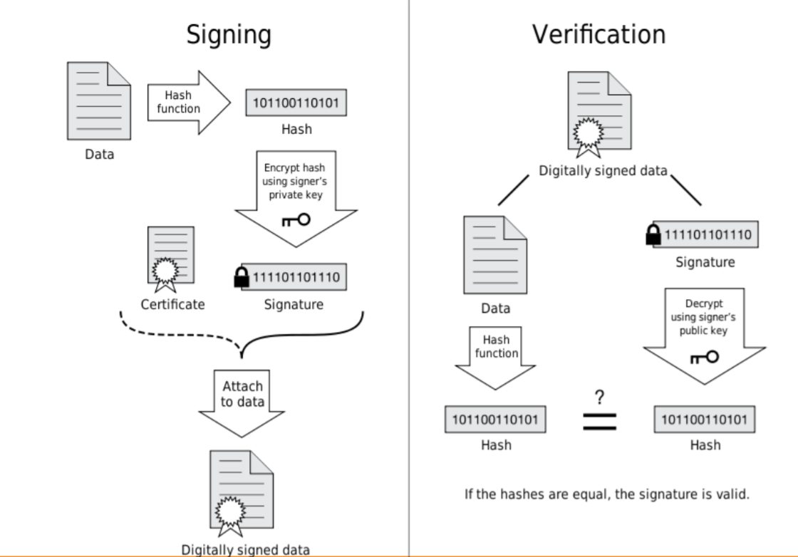

# Tutorial 10

## Question 1

Compare and contrast transport security and message security as used in web services.

## Answer 1

#### Message Security

Secure the message - don't need underlying protocol to be secure.

- **Pros**
  - Different parts of a message can be secured in different ways
  - Asymmetric: different security mechanisms can be applied to request and response
  - Self protecting messages (transport independent)
- **Cons**
  - Securing XML is complicated and an overhead

#### Transport Security

Rely on the underlying protocol to secure the message for you
- REST but may need more than this

- **Pros**
  - Widley available, mature technologies (**SSL, TLS, HTTPS**)
  - Understood by most system administrators
- **Cons**
  - Point to point: complete message is in clear after each hop
  - Symmetric: Request and response messages must use same security principles
  - Transport specific


## Question 2

The following three bytes of plaintext (given in binary form) are to be encrypted using the standard XOR logical function, woith key `10001011`. Give the resulting ciphertext. Now apply the key and XOR function to the ciphertext, and verify that the original bytes are recovered.

```
01001011 01000101 01000111
```

Comment on the nature and use of XOR as a web based encryption algorithm

## Answer 2

To calculate XOR the the given value with the key - to decrypt do the same.

```
01001011 01000101 01000111    < Value to encrypt
10001011 10001011 10001011    < Key (repeated)
==========================
11000000 11001110 11001100    < Encrypted value
10001011 10001011 10001011    < Key (repeated)
==========================
01001011 01000101 01000111    < Original value to encrypt
```

- XOR is easily and efficiently implemented in hardware
- susceptible to pattern recognition
- very weak and not suitable for use on the web
- symmetric key so requires way of secuerly distributing the key value

## Question 3

A simple encryption algorithm users binary XOR with a one-time pad. For the plaintext in binary `1001 1110 1111 0001`, define your own one time pad and demonstrate the encryption and decryption processes.

Comment on the advantages and disadvantages of using one-time pads.

## Answer 3

To calculate XOR the the given value with the one time pad (pad should be same length as the message) - to decrypt do the same.

One time pad = `0001 1000 1101 0101`

```
1001 1110 1111 0001   < Value to encrypt
0001 1000 1101 0101   < One time pad
===================
1000 0110 0010 0100   < Encrypted value
0001 1000 1101 0101   < One time pad
===================
1001 1110 1111 0001   < Original value to encrypt
```

## Question 4

Explain what is meant by a digital signature and discuss how this technology is used in TLS.

## Answer 4

- **Digital signatures** provide a way of validating a document proving the integrity of its contents of origin. They provide guarantee of integrity of:
  - The documents contents i.e. to prove tto the recipient that the contents have not been tampered woth by a third party
  - The document at a later date i.e. so that the recipient can prove that he/she has the document in its original form
  - sender must have the corresponding private key
    - so provides a guarantee of documents origin
- They use public key encryption and hash algorithms
- **Notice by itself this does not garuntee the origins identity**
  - only that they have the private key that signed the document



- Digital signatures usually use public key encryption. *Generically* they are used as follows:
  1. sender uses message to calculate **message digest** i.e. message checksum (this is also called a **hash** or **message authentication code** (MAC) and the algorithm used is a **one way hash algorithm** e.g. SHA-2).
  2. sender encrypts message digest (with an optional timestamp) with sender's private key to form digital signature
  3. sender sends message and digital signature
  4. receiver decrypts digital signature with senders public key to recover message digest and timestamp
  5. receiver recalculates message digest and compares against received one; if they are the same then message is authenticated
- The timestamp adds to the confidence that the opaque message has not been recorded and repllayed at a later data
- It may rely on a cretification to provide confidence in the **identity** of the origin of the public key


## Question 5

Discuss the features of HTTPS(Secure HTTP). How does HTTPS acheive client authentication? How does HTTPS relate to TPS?

## Answer 5

- HTTPS layers HTTP over SSL/TLS
  - HTTPS has exactly the same request-types, request and response headers as HTTP.
- What HTTPS provides is a secure, encrypted HTTP channel on TLS/SSL transparent to users.
  - however HTTPS inly users the TLS/SSL feature to authenticate the server to the client
  - client authentiction is part of HTTP and is defined in rfc2617 (and has been extended from this)
    - in fact **basic** and **digest** authentication on the next few slides are both used inn both HTTP *and* HTTPS

#### HTTP client authentication

1. browser/client attempts to request a page/access to resource
2. server responds with `402 Unauthorized` and a `WWW-Authenticate:` header containing a challenge e.g. identifying the server and thereby asking for a username/password for it
3. browser/client prompts user for credentials, then re-sends the request with an `Authorisation:` header containing a response to the challange.
