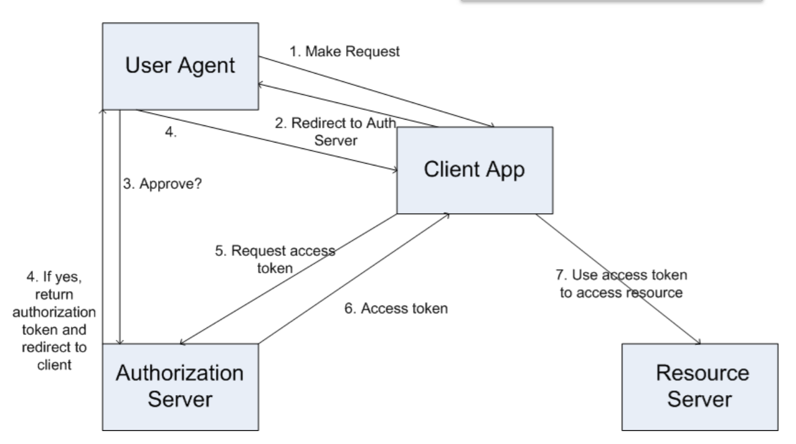

# Tutorial 9

## Question 1

Discuss the top security threats to/concerns in cloud computing as identified by the Cloud security Alliance (CSA) in 2016. Explain especially in detail the top three threats.

## Answer 1

- CSA is a non-profit organization that promotes research into and use of best practices for providing security assurance within cloud computing.
  - AWS and MIcrooft etc. are members
- Periodically identifies, collates and ranks the cloud computing industry's top security concerns and threats.
  - latest assessment was in 2016
- Also provides certification, identification of best practices to address the security concerns and threats etc.

**Top three concerns**

- #### Data breaches
  - **Description**
    - An incedent in which sensitive, protected or confidential data is released, viewed, stolen or used by an individual who is not authorised to do so.
    - Data compromise due to improper access controls or weak encryption.
    - Poorly secured data at a greater risk in multi-tenant architectures.
  - **Address threat**
    - Proper data encryption, user credential and backup policies and their enforcement required.
  - **Examples**
    - Anthem's Breach and Ubiquity of comprimised credentials
    - Anti-virus firm BitDefender admits breach, Hacker claims Stolen passwords are Unencrypted
    - TalkTalk criticised for poor security and handling of attack.
- #### Weak identity, credential na daccess management
  - **Description**
    - Data breaches and enabling of attacks can occur nbecause of a lack of scalable identity access management systems, failure to use multifactor authentication, weak password use and a lack of ongoing autoimated rotation of cryptographic keys, passwords and certificates.
  - **Address Threat**
    - Proper encryption and key management; proper implementation of identity, entitlement and access management, use of multi-factor authentication.
    - Meed lifecycle management of identities e.g. immediate de-provisioning of access to resources on personnel changes etc.
  - **Examples**
    - Attackers Scrape Github for Cloud service credentials, Hijack account ti mine virtual currency
    - Dell releases fix for root certificate fail
- #### Insecure APIs
  - **Description**
    - APIs (usually HTTP/REST based) designed to permit access to functionality and data may be vulnerable or improperly utilized exposing applications to attack.
    - Cloud provisioning, management, orchestration and monitoring are also all performed using these interfaces.
    - Exposure of credentials to third-partiest in order to allow API execution.
  - **Address threat**
    - Awareness necessary that reliance on a weak set of interfaces and APIs exposes organizations to a variety of security issues related to confidentiality, integrity, availability and accountability.
    - Proper design required of APIs incorporating up-to-date technology versions and security: identify and access management, encryption and activity monitoring.
  - **Examples**
    - 80% of tested applications not using available security in APIs (e.g. unencrypted traffic and basic authentication) and demonstrated Attackers
      - insecure API implementations threaten clouds
      - web services single sign-on contains big flaws

## Question 2

Discuss what is meant by CSA's Consensus Assessments Initiative Questionnaire and Cloud controls matrix.

## Answer 2

- Consensus Assessments Initiative Questionnaire (CAIQ)
  - pronounced "cake"
  - set of 140 questions auditors or potential customers should ask a cloud service provider in order to assess their security compliance before agreeing to use them.
- Cloud COntrols Matrix (CCM)
  - A detailed list of requirements and controls across 16 domains.
  - references many ofther security standards
  - what has (not) been implemented by a provider helps customers assess overall security risks.
  - also lists fundamental best-practice security principles to guide a cloud provider.

## Question 3

What is CSA STAR? Discuss how STAR self-assessment is acheived and what this means.

## Answer 3

- #### CSA STAR Self-Assessment
  - Providers either submit a completed CAIQ themselves or submit a report documenting compliance with the CCM.
    - CSA only undertake a basic check of factual accuracy.
  - Most industry cloud providers have entries spanning IaaS, PaaS and SaaS offerings.
  - Entries deleted unless maintained after 18 months.
  - A good example is **MS Office 365** (SaaS) compliance documentation.#
    - this goes through in detail how Office 365 addresses the relevant control entries in the CCM to convince potential customers...
    - Last updated April 2016

## Question 4

Discuss the features of OAuth 2.0. Discuss how OAuth 2.0's web server flow operates to secure RESTful applications. Use a disgram. How is it used in the cloud.

## Answer 4

#### OAuth 2.0

- Open source - rfc6749
- A federated, *delegated* mechanism to integrate secure RESTful services.
  - intended to be lightweight
  - Facebook, Twitter, Google, Github, Dropbox, Soundcloud, MS...
- Popular also for use with cloud platforms.
  - e.g. MS Azure, AWS
  - because they increasingly provide RESTful APIs to access cloud resources.
- OAuth is an *authorization* protocol that allows third-party web service creators to get access to users' data stored in a different web service.
  - However it is generalised enough to be used also with browser based apps and mobile apps in several defined scenarios (**flows**).
    - these notes consider web services only (**web server flow**).
- OAuth is abount granting and gaining permission to acces resources i.e. *authorisation*
  - not in itself about authentication.
- With OAuth, users don't manage access to their resources themselves nor divulge their login information to intermediaries.
  - authorization is granted from an **authorisation server**, where access rights to owner's resources are stored
    - authorisation granted as a one-time opaque **authorisation token/code**
  - an intermediary subsequently obtains a time limited **access token** this is used to access data from a **resource server**
- Reliant on HTTPs to secure some functionality.
  - uses custom token authentication (Bearer) and Schannel.

#### OAuth 2.0 for RESTful web services

- Four entities
  - User agent
    - typically a browser (but could of course be anything...)
  - Client app (Web service)
    - web service the user is calling which acts as a client to the resource server.
  - Resource server
    - 3rd party secure web service.
    - what we need to obtain permission to use.
  - Authorisation server.
    - deals with access requests from users
    - may be combined with resource server in some implementations.

- Uses redirect URLs (response code 302)
- Redirect URLs are being protected by HTTPs which prevents tokens being intercepted in transit
- The granting of a specific access toke n allows a fine grained decision about access to data to be made.
  - e.g. it may only permit read-only access for this user and/or Client
  - client submits **authorisation token** to obtain **access token**
- Users, clients and resource servers require to be registered with the authorisation server.
  - remember resource and authorisation services may be combined
  - client url redirect URL registered to avoid malicious redirects.
  - users must be authenticated against the authorisation server but OAuth does not specify how

## Question 5

Discuss the features of OpenID Connect. How is it related to OAuth? How is it used in the cloud?

## Answer 5

- For authentication OAuth can add the use of
  - Microsoft IDs
  - SAML assertions (enterprise tokens confirming you who you are)
  - your own scheme...
  - or use **Open ID** to extend OAuth for use as an authentication protocol.
- **OpenID Connect** is a distributed, federated third party identity services.
  - a **single-sign-on** (SSO) protocol
  - **OpenID Providers**
    - Google, Facebook, Paypal, Yahoo!
    - Cloud: MS Azure Active Directory (Azure AD), and AWS identity and Access management.
  - web appps no longer manage authentication themseleves
    - service does not see client secret (password, biometric data...) - sees **token** instead.
  - Microsoft IDs are not unified (yet) with OpenID...
    - currently you create a seperate user space in Azure AD
    - but MS have started to unify the API & tool support
  - OpenID Connect is current version.
  - The key to understanding OpenId is to realise OpenId itself users OAuth flows to obtain authentication tokens and an OpenID provider.
    - human users are redirected to OpenID provider log in
    - tokens are subsequently presented to 3rd parties to prove authentication has taken place.
    - ID tokens - again users Bearer tokens in HTTP(s) custom authentication
      - as it uses OAuth...

- OAuth and OpenID in the Cloud
  - A big reliance now on RESTful web services hosted in the cloud which must be secure.
  - Access to cloud storage through URLs must be secure
  - Both OAuth and OpenID have a big presence in the cloud
    - Azure AD and AWS Identify and Access managfement both heavily use them and both are offered as services and kept up to date by them.
    - AWS have internal policy that every service myst be available as a RESTful service and even internal access to services uses OAuth/OpenID
  - AWS and Azure AD both support creation and hosting of OpenID connect identity providers in the cloud.
